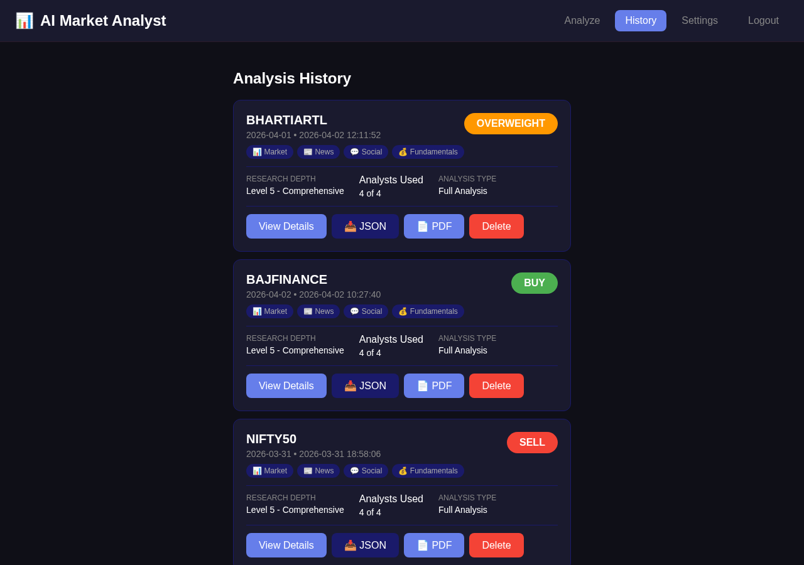
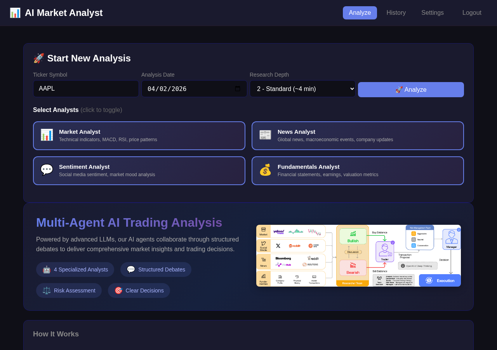
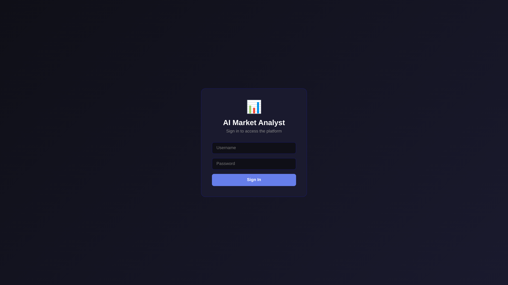

# TradingAgents Web UI

<div align="center">

A modern, user-friendly web interface for the [TradingAgents](https://github.com/TauricResearch/TradingAgents) multi-agent trading framework.

**Real-time monitoring • Easy configuration • Historical analysis review**

[](https://choosealicense.com/licenses/mit/)
[](https://www.python.org/downloads/)
[](https://flask.palletsprojects.com/)

</div>

---

## 🎯 Overview

This Web UI provides an intuitive interface for running trading analyses using the TradingAgents framework. Instead of using the command line, you get a beautiful dark-themed dashboard where you can:

- **Run analyses** with just a few clicks
- **Watch progress** in real-time as agents work
- **Review history** of all past analyses
- **Configure settings** easily through the UI

Perfect for researchers, traders, and anyone who wants to leverage multi-agent LLM trading analysis without the complexity of command-line tools.

## 📸 Screenshots

### Main Dashboard


### Real-Time Analysis


### Settings Configuration


## ✨ Features

### 📊 Real-Time Analysis Monitoring
- Watch your trading analysis progress step-by-step
- Live log streaming with status updates
- Visual progress indicators for each phase:
  - Market data fetching
  - Individual analyst reports (Fundamentals, Sentiment, News, Technical)
  - Bullish/bearish research debates
  - Trading plan development
  - Risk assessment
  - Final portfolio decision

### 🎯 Intuitive Dashboard
- Clean, modern dark-themed interface
- Simple ticker symbol input
- Date picker for historical or current analysis
- Customizable analyst selection
- Adjustable analysis depth (1-5 levels)

### 📈 Historical Analysis Review
- Browse all past analyses
- Filter by ticker, date, or status
- View detailed reports from each analyst
- See research team debates
- Review final trading decisions and reasoning

### ⚙️ Easy Configuration
- Built-in settings page
- Support for multiple LLM providers:
  - OpenAI GPT-5.x
  - Google Gemini 3.x
  - Anthropic Claude 4.x
  - X.AI Grok 4.x
  - Z.AI GLM 5.x
  - Custom endpoints
- Persistent configuration storage

### 🔄 Background Processing
- Long-running analyses execute in background
- Continue using the UI while analyses run
- Run multiple analyses simultaneously
- Stop analyses mid-execution if needed
- Automatic progress tracking

## 🚀 Quick Start

### Prerequisites
- Python 3.8 or higher
- API key from your preferred LLM provider

### Installation

```bash
# Clone the repository
git clone https://github.com/ashrinkm/TradingAgents-UI.git
cd TradingAgents-UI

# Create virtual environment (recommended)
python -m venv venv
source venv/bin/activate  # On Windows: venv\Scripts\activate

# Install dependencies
pip install -r requirements.txt
pip install flask

# Run the Web UI
python app.py
```

Open your browser to `http://localhost:5000` and you're ready to go!

### First-Time Setup

1. **Configure API Key**: Click "Settings" in the navigation
2. **Enter your API key** from your LLM provider
3. **Select provider** and model
4. **Save settings**

You're now ready to run your first analysis!

## 📖 Usage

### Running an Analysis

1. **Enter Ticker**: Type a stock symbol (e.g., AAPL, GOOGL, TSLA, NVDA)
2. **Select Date**: Choose analysis date (defaults to today)
3. **Choose Analysts**: Select which analysts to include:
   - ✅ **Fundamentals Analyst** - Company financials and metrics
   - ✅ **Sentiment Analyst** - Social media and public sentiment
   - ✅ **News Analyst** - Global news and macro events
   - ✅ **Technical Analyst** - Chart patterns and indicators
4. **Set Depth**: Choose 1-5 (higher = more thorough, slower)
5. **Start**: Click "Start Analysis"

### Monitoring Progress

Watch the analysis unfold in real-time:

- ✓ **Completed steps** show green checkmarks
- ● **Running steps** show animated indicators  
- ○ **Pending steps** show what's coming next

Each phase displays live logs so you can see exactly what the agents are thinking.

### Viewing Results

After completion, navigate to "History" to:
- Browse all past analyses
- Filter by ticker or date
- Click any analysis to see:
  - Executive summary
  - Individual analyst reports
  - Research team debates
  - Final trading decision
  - Risk assessment
  - Complete reasoning chain

### Background Jobs

- Start an analysis and continue using the UI
- Check job status on the "Running Jobs" page
- Stop jobs if they're taking too long
- All jobs are tracked and recoverable

## 📁 Project Structure

```
TradingAgents-UI/
├── app.py                    # Flask web application
├── background_worker.py      # Background analysis processor
├── templates/                # HTML templates
│   └── index.html           # Main UI template
├── tradingagents/           # Core TradingAgents framework
├── assets/                  # Documentation assets
│   └── screenshots/         # UI screenshots
├── data/                    # Runtime data (created automatically)
│   ├── settings.json        # Your configuration
│   ├── analyses.json        # Analysis history
│   └── jobs/                # Background job tracking
├── run_flask.sh             # Flask launcher script
└── requirements.txt         # Python dependencies
```

## 🔧 Advanced Configuration

### Environment Variables

Create a `.env` file in the project root:

```bash
# API Keys
OPENAI_API_KEY=your-key-here
GOOGLE_API_KEY=your-key-here
ANTHROPIC_API_KEY=your-key-here
XAI_API_KEY=your-key-here

# Custom API endpoint (optional)
OPENAI_BASE_URL=https://api.openai.com/v1
```

### Custom Models

The UI supports any OpenAI-compatible API endpoint:

```json
{
  "api_key": "your-key",
  "base_url": "https://your-custom-endpoint.com/v1",
  "model": "your-model-name",
  "provider_name": "Custom Provider"
}
```

### Analysis Depth Guide

- **Depth 1**: Quick analysis (1-2 minutes) - Good for screening
- **Depth 2**: Standard analysis (2-3 minutes) - Balanced speed/detail
- **Depth 3**: Detailed analysis (3-5 minutes) - Recommended default
- **Depth 4**: Comprehensive (5-7 minutes) - Deep analysis
- **Depth 5**: Exhaustive (7-10 minutes) - Maximum detail

## 🐳 Docker Deployment

```dockerfile
FROM python:3.9-slim

WORKDIR /app
COPY requirements.txt .
RUN pip install -r requirements.txt
RUN pip install flask

COPY . .

EXPOSE 5000
CMD ["python", "app.py"]
```

Build and run:
```bash
docker build -t tradingagents-ui .
docker run -p 5000:5000 tradingagents-ui
```

Or use Docker Compose:

```yaml
version: '3.8'
services:
  tradingagents-ui:
    build: .
    ports:
      - "5000:5000"
    volumes:
      - ./data:/app/data
    environment:
      - OPENAI_API_KEY=${OPENAI_API_KEY}
```

## 🌐 Cloud Deployment

### Heroku

```bash
heroku create tradingagents-ui
heroku config:set OPENAI_API_KEY=your-key
git push heroku main
```

### AWS/GCP/Azure

Use the Docker image for deployment on any cloud platform.

### PythonAnywhere

1. Upload code to PythonAnywhere
2. Create a web app with Flask
3. Set virtual environment and install dependencies
4. Configure environment variables
5. Reload the app

## 🔍 Troubleshooting

### UI Won't Start

```bash
# Ensure all dependencies are installed
pip install -r requirements.txt
pip install flask

# Check Python version (3.8+ required)
python --version

# Check for port conflicts
lsof -i :5000  # Use a different port if needed
```

### Analysis Fails to Start

- ✅ Check API key is configured in Settings
- ✅ Verify base_url is correct
- ✅ Ensure you have API credits/quota
- ✅ Check logs in browser console (F12)
- ✅ Review Flask console output for errors

### Background Jobs Not Running

```bash
# Ensure data directory exists
mkdir -p data/jobs

# Check permissions
chmod +x background_worker.py run_flask.sh
```

### Can't See Past Analyses

- Check `data/analyses.json` exists
- Verify analyses completed successfully
- Look for error messages in job files
- Check file permissions

## 💡 Tips & Best Practices

### Performance
- **Quick screening**: Use depth 1-2 for initial ticker scans
- **Deep analysis**: Use depth 4-5 for promising opportunities
- **Parallel analysis**: Run multiple analyses for portfolio review
- **Resource management**: Stop unused analyses to free resources

### Accuracy
- **Balanced view**: Select all analysts for comprehensive analysis
- **Depth matters**: Use higher depth for complex decisions
- **Historical patterns**: Review past analyses to identify trends
- **Compare**: Run multiple tickers before making decisions

### Cost Management
- **Start small**: Use depth 1-2 for initial screening
- **Be selective**: Increase depth only for promising opportunities
- **Monitor usage**: Check API usage in provider dashboard
- **Rate limiting**: Add delays between bulk analyses

## 🤝 Contributing

Contributions are welcome! Areas for improvement:

- 📊 Additional chart visualizations
- 📄 Export formats (PDF, Excel)
- 💼 Portfolio tracking features
- 🔔 Price alerts and notifications
- 📈 Backtesting integration
- 🌍 Multi-language support
- 🎨 Theme customization

## 📚 Related Projects

- **[TradingAgents](https://github.com/TauricResearch/TradingAgents)** - The underlying multi-agent framework
- **[Trading-R1](https://github.com/TauricResearch/Trading-R1)** - Advanced trading terminal

## 📄 License

This project is licensed under the MIT License - see the [LICENSE](LICENSE) file for details.

## 🙏 Acknowledgments

Built on top of the excellent [TradingAgents](https://github.com/TauricResearch/TradingAgents) framework by [Tauric Research](https://tauric.ai/).

## ⚠️ Disclaimer

This tool is for **research and educational purposes only**. Trading performance may vary based on many factors including:
- Chosen LLM provider and model
- Model parameters (temperature, etc.)
- Trading period and market conditions
- Data quality and timeliness

**This is not financial, investment, or trading advice.** Always conduct your own research and consult with qualified professionals before making trading decisions. Past performance does not guarantee future results.

## 🆘 Support

- **Documentation**: [WEB_UI_README.md](./WEB_UI_README.md)
- **Issues**: [GitHub Issues](https://github.com/ashrinkm/TradingAgents-UI/issues)
- **Original Framework**: [TradingAgents](https://github.com/TauricResearch/TradingAgents)
- **Community**: [Discord](https://discord.com/invite/hk9PGKShPK)

---

<div align="center">

**Made with ❤️ for the trading research community**

⭐ Star this repo if you find it useful! ⭐

</div>
